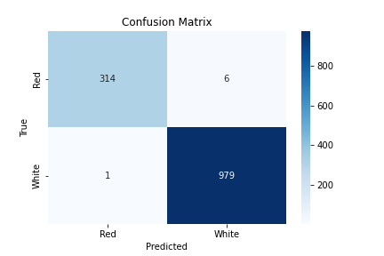

# 🍷 Wine Quality Analysis

This project explores the **Wine Quality** dataset to uncover insights into the factors affecting wine quality and builds predictive models to classify wines based on their physicochemical properties.

The analysis covers both **Exploratory Data Analysis (EDA)** and **Machine Learning Modeling**, focusing on red and white wine datasets separately.

---

## 📚 Tools and Libraries

- Python
- Pandas
- Numpy
- Seaborn
- Matplotlib
- Scikit-learn
- XGBoost

---

## 📈 Project Overview

- **EDA**: Data cleaning, correlation analysis, and feature distribution visualizations.
- **Feature Engineering**: Creation of new features and transformations where needed.
- **Model Building**: Training classification models (Random Forest, XGBoost).
- **Model Evaluation**: Confusion matrix and accuracy analysis.
- **Feature Importance**: Understanding which features contribute most to wine quality prediction.

---

## 🖼️ Key Visuals

### Feature Importance


### Confusion Matrix



---

## 🚀 How to Run

1. Clone this repository:
```bash
git clone https://github.com/Gokcisan/Wine-Quality-Analysis.git
